# Отчет по работе 2

### Задание 1

* **Тип в программировании** – характеристика данных, задающая множество допустимых значений и операции, которые можно с ними выполнять.
* **Статическая типизация** – тип объекта данных определяется во время компиляции.
* **Динамическая типизация** – тип объекта данных определяется во время выполнения программы.
* **Неявная типизация** – тип определяется автоматически без явного указания его программистом.
* **Явное преобразование типа** – преобразование типа, которое программист явно указывает в программе.
* **Неявное преобразование типа** – преобразование типа, которое выполняется автоматически.
* **Сильная типизация** – язык строго контролирует совместимость типов и ограничивает неявные преобразования между ними.
* **Слабая типизация** – язык допускает большое количество неявных преобразований между различными типами.

### Задание 2

**Преобразования при присваивании**

* При присваивании значение правого операнда неявно преобразуется к типу левого операнда.
* Целочисленный тип может преобразовываться в другой целочисленный тип.
* При преобразовании целого числа в вещественный тип возможно потеря точности.
* При преобразовании вещественного числа в целочисленный тип дробная часть отбрасывается.
* Значения `0` и `nullptr` при преобразовании в `bool` дают `false`, остальные значения дают `true`.
* При преобразовании `bool` в целочисленный тип `false` становится `0`, а `true` — `1`.

**Преобразования при арифметических операциях**

* Перед арифметической операцией выполняются необходимые неявные преобразования типов.
* Типы `bool`, `char` и `short` обычно сначала преобразуются к `int` — это называется целочисленным продвижением.
* Если один операнд имеет вещественный тип, целочисленный операнд преобразуется к соответствующему вещественному типу.
* При операциях между целочисленными типами учитываются их разрядность, знаковость и ранг.
* Если `int` и `unsigned int` участвуют в одной арифметической операции, `int` обычно преобразуется в `unsigned int`.
* При целочисленном делении результат также является целым числом: дробная часть отбрасывается.

**Преобразования с логическими значениями**

* При использовании значения в условии оно неявно преобразуется к `bool`.
* `0` преобразуется в `false`, любое ненулевое значение — в `true`.
* `false` при преобразовании в число становится `0`, а `true` — `1`.
* Результатом операторов сравнения (`==`, `!=`, `<`, `>`) и логических операторов (`&&`, `||`, `!`) является значение типа `bool`.
* При арифметических операциях `bool` подвергается целочисленному продвижению и превращается в `0` или `1`.

### Задание 3

*Пример на C++:*

```cpp
#include <iostream>

int main() {
    int x = 7;
    double y = x;
    char z = x;
    bool flag = x;

    std::cout << y << " " << (int)z << " " << flag << std::endl;

    return 0;
}
```

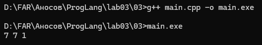

В C++ программа компилируется. Здесь выполняются неявные преобразования `int` в `double`, `char` и `bool`.

*Пример на Java:*

```java
public class Main {
    public static void main(String[] args) {
        int x = 7;
        double y = x;
        char z = x;
        boolean flag = x;

        System.out.println(y + " " + z + " " + flag);
    }
}
```

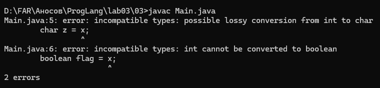

В Java программа не компилируется. Ошибки возникают при преобразовании `int` в `char` и `boolean`, так как такие преобразования не выполняются неявно.

Таким образом, в данном примере C++ допускает больше неявных преобразований типов, чем Java.

### Задание 4

*Программа:*

```cpp
#include <iostream>
#include <typeinfo>

int main() {
    bool x = true, y = false;
    auto a = x & y;
    std::cout << typeid(a).name() << std::endl;
    auto b = x && y;
    std::cout << typeid(b).name() << std::endl;
}
```
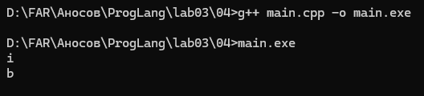

    * Переменная a: оператор & (побитовое И) требует целого числа. bool неявно преобразуется к int: true - 1, false - 0. Результат: 1 & 0 = 0, тип a – int.
    * Переменная b: оператор && (логическое И) работает с логическими значениями. Результат: true && false = false, тип b – bool.
    * Программа выведет для a букву i (int), для b – букву b (bool).

### Задание 5

* Пример `typedef`:

```cpp
#include <iostream>

typedef unsigned long long Money;

int main() {
    Money price = 1500;
    Money bonus = 500;

    std::cout << price + bonus << std::endl;
}
```

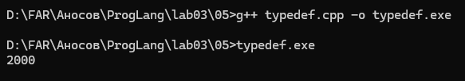

*typedef создаёт другое имя для существующего типа. Здесь Money используется как имя для типа unsigned long long.*

* Пример auto:

```cpp
#include <iostream>

int main() {
    auto price = 250;
    auto quantity = 3;

    std::cout << price * quantity << std::endl;
}
```

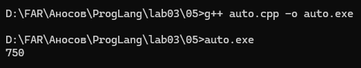

*auto автоматически определяет тип переменной по её значению. Здесь price и quantity имеют тип int.*

* Пример decltype:

```cpp
#include <iostream>

int main() {
    double price = 99.5;
    decltype(price) discount = 10.0;

    std::cout << price - discount << std::endl;
}
```

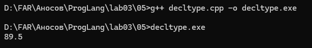

*decltype определяет тип по указанной переменной или выражению. Здесь discount имеет такой же тип, как и price, то есть double.*

* Пример static_cast:

```cpp
#include <iostream>

int main() {
    int total = 10;
    int count = 3;

    double average = static_cast<double>(total) / count;

    std::cout << average << std::endl;
}
```

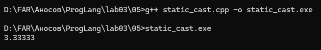

*static_cast выполняет явное преобразование типа. Здесь total преобразуется в double, поэтому результат деления получается вещественным.*

* Пример sizeof:

```cpp
#include <iostream>

int main() {
    int numbers[] = {10, 20, 30, 40, 50};

    std::cout << sizeof(numbers) / sizeof(numbers[0]) << std::endl;
}
```

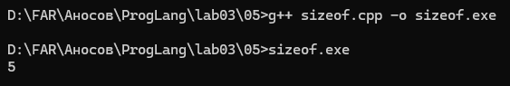

*sizeof возвращает размер объекта в байтах. Здесь с его помощью определяется количество элементов массива.*

### Задание 6

* Полный код программы:
 ```cpp
 #include <iostream>
 int main() {
     int a = -1, b = 1;
     unsigned int c = 1;
     std::cout << a * b << std::endl;
     std::cout << a * c << std::endl;
 }
 ```

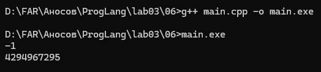

* `a * b`: оба операнда типа int, результат int: -1 * 1 = -1.
* `a * c`: один операнд int, другой unsigned int. По правилам неявного преобразования знаковый приводится к беззнаковому. -1 превращается в 2^32 - 1 = 4294967295. Результат: 4294967295 * 1 = 4294967295.

* Если заменить int на short, а unsigned int на unsigned short:
    ```cpp
    #include <iostream>
    int main() {
        short a = -1, b = 1;
        unsigned short c = 1;
        std::cout << a * b << std::endl;
        std::cout << a * c << std::endl;
    }
    ```

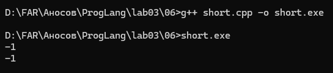

    * `a * b`: оба операнда short, при арифметической операции приводятся к int. Результат: -1 * 1 = -1.
    * `a * c`: short и unsigned short при арифметической операции сначала приводятся к int (потому что их размер меньше int). Поэтому -1 остаётся -1. Результат: -1 * 1 = -1.
    * Обе строки выводят -1, потому что в обоих случаях типы приводятся к знаковому int.
    * **Вывод:** для int + unsigned int знаковый приводится к беззнаковому, результат 4294967295. Для short + unsigned short оба приводятся к int, результат -1 и -1.

### Задание 10

* Пример программы:
    ```python
    a = input()
    if a:
        print("OK")
    else:
        print("FAIL")
    ```

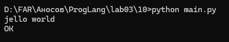

* Если пользователь вводит хотя бы один символ, строка считается истинным значением (`True`). Если ввод оставить пустым, получается `False`.
* В первом запуске была введена строка `jello world`, поэтому программа вывела `OK`.
* Во втором запуске ввод был оставлен пустым, поэтому программа вывела `FAIL`.
* **Вывод:** при проверке строки в условии `if` Python автоматически преобразует её в логическое значение. Пустая строка считается `False`, а строка с любым содержимым — `True`.