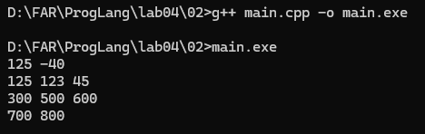
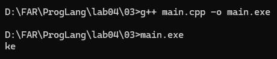
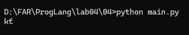
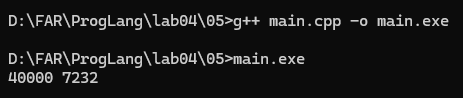
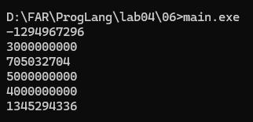
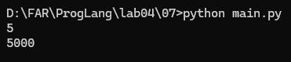
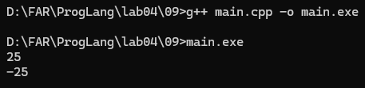

# Языки программирования
## Лабораторная работа 4

### Задание 1

*Запишите двоичное представление числа -99 в целочисленном знаковом типе длиной 1, 2, 4 байта.*

* **1 байт (8 бит):**
  * `99 = 0110 0011`
  * Инверсия: `1001 1100`
  * Прибавляем `1`: `1001 1101`
  * Ответ: `10011101`

* **2 байта (16 бит):**
  * `99 = 0000 0000 0110 0011`
  * Инверсия: `1111 1111 1001 1100`
  * Прибавляем `1`: `1111 1111 1001 1101`
  * Ответ: `1111111110011101`

* **4 байта (32 бита):**
  * `99 = 0000 0000 0000 0000 0000 0000 0110 0011`
  * Инверсия: `1111 1111 1111 1111 1111 1111 1001 1100`
  * Прибавляем `1`: `1111 1111 1111 1111 1111 1111 1001 1101`
  * Ответ: `11111111111111111111111110011101`

*Запишите литералы, равные наибольшему и наименьшему числу в типе* `int` *в шестнадцатеричной записи.*

* Наибольшее: `2^31 - 1 = 2147483647 = 0x7FFFFFFF`.
* Наименьшее: `-2^31 = -2147483648 = 0x80000000`.

*Запишите двоичное представление символа* `#` *в типе* `char`.

Код символа `#` в ASCII равен `35`.

* `35 = 0010 0011`
* Ответ: `00100011`.

### Задание 2

*Напишите пример программы на С++ с использованием целочисленных литералов в разных форматах записи, разной длины, знаковых и беззнаковых. Пример должен охватывать большинство способов записи целочисленных литералов.*


* Пример на C++:

```cpp
#include <iostream>

int main() {
    int a = 125;
    int b = -40;
    int c = 0175;
    int d = 0x7B;
    int e = 0b101101;

    unsigned int f = 300U;
    long g = 500L;
    unsigned long h = 600UL;
    long long i = 700LL;
    unsigned long long j = 800ULL;

    std::cout << a << " " << b << std::endl;
    std::cout << c << " " << d << " " << e << std::endl;
    std::cout << f << " " << g << " " << h << std::endl;
    std::cout << i << " " << j << std::endl;

    return 0;
}
```

    


*В программе использованы десятичные, восьмеричные, шестнадцатеричные и двоичные целочисленные литералы, а также суффиксы `U`, `L`, `UL`, `LL` и `ULL` для указания типа литерала.*

### Задание 3

*Объясните работу фрагмента программы на С++. В ходе объяснения следует использовать таблицу кодов символов.*

* Фрагмент программы:
    ```cpp
    char a = 'a';

    a = a + 10;
    std::cout << a;
    a = a + 250;
    std::cout << a;
    ```

Код символа `a` в ASCII равен `97`.

После выполнения:

`97 + 10 = 107`

Коду `107` соответствует символ `k`.

Затем:

`107 + 250 = 357`

Для 8-битного `char` при переполнении:

`357 mod 256 = 101`

Коду `101` соответствует символ `e`.

Таким образом, результат работы программы:

`ke`

    


### Задание 4

*Перепишите программу из предыдущего задания на Python, используя функции* `chr` *и* `ord`.

* Полный код программы:
    ```python
    a = 'a'

    a = chr(ord(a) + 10)
    print(a, end='')

    a = chr(ord(a) + 250)
    print(a)
    ```

    


*Функция* `ord()` *возвращает числовой код символа, а функция* `chr()` *возвращает символ по его числовому коду.*

`ord('a') = 97`

`97 + 10 = 107 - 'k'`

`107 + 250 = 357 - 't`

*Вывод отличается от программы на C++, потому что Python использует Unicode для строковых символов. В C++ тип* `char` *имеет ограниченный размер, поэтому при переполнении результат отличается.*

### Задание 5

*Объясните работу фрагмента программы на С++. В частности, почему* `x + x - x = x`, *но при этом* `(x * 2) / 2 != x`? *В отчете надо привести вычисления, приводящие к ответу.*

* Фрагмент программы:
    ```cpp
    unsigned short x = 40000;
    unsigned short y = x + x;
    unsigned short z = x * 2;

    y = y - x;
    z = z / 2;

    std::cout << y << " " << z << std::endl;
    ```

`unsigned short` занимает 2 байта, поэтому принимает значения от `0` до `65535`.

Изначально:

`x = 40000`

Вычислим `y`:

`x + x = 40000 + 40000 = 80000`

Происходит переполнение:

`80000 - 65536 = 14464`

Поэтому:

`y = 14464`

Вычислим `z`:

`x * 2 = 40000 * 2 = 80000`

`80000 - 65536 = 14464`

Поэтому:

`z = 14464`

Теперь:

`y = y - x`

`y = 14464 - 40000`

`y = -25536`

Для беззнакового типа:

`-25536 + 65536 = 40000`

Следовательно:

`y = 40000`

Вычисляем `z`:

`z = 14464 / 2 = 7232`

Результат:

`40000 7232`

    


*Выражение* `x + x - x` *возвращает исходное значение* `x`, *поскольку после переполнения последующее вычитание снова приводит к* `40000` *с учетом арифметики по модулю* `65536`.

*При вычислении* `(x * 2) / 2` *после переполнения исходная информация теряется:*

`40000 * 2 = 80000 дает 14464`

`14464 / 2 = 7232`

*Поэтому результат отличается от исходного значения* `40000`.

### Задание 6

*Объясните работу фрагмента программы на С++. Если имеет место переполнение, то требуется найти точный ответ до запуска программы, а только потом сверить его с выводом. В отчете надо привести вычисления, приводящие к ответу.*

* Фрагмент программы:
    ```cpp
    std::cout << 2000000000 + 1000000000 << std::endl;
    std::cout << 2000000000U + 1000000000U << std::endl;
    std::cout << 2500000000U + 2500000000U << std::endl;
    std::cout << 2500000000LL + 2500000000LL << std::endl;
    std::cout << 20000U * 200000U << std::endl;
    std::cout << 200000U * 200000U << std::endl;
    ```

#### 1. `2000000000 + 1000000000`

`2000000000 + 1000000000 = 3000000000`

Максимальное значение 32-битного `int`:

`2147483647`

Происходит переполнение:

`3000000000 - 4294967296 = -1294967296`

**Ответ:** `-1294967296`.

#### 2. `2000000000U + 1000000000U`

Используется `unsigned int`.

`2000000000 + 1000000000 = 3000000000`

Значение `3000000000` помещается в диапазон `unsigned int`.

**Ответ:** `3000000000`.

#### 3. `2500000000U + 2500000000U`

`2500000000 + 2500000000 = 5000000000`

Происходит переполнение:

`5000000000 - 4294967296 = 705032704`

**Ответ:** `705032704`.

#### 4. `2500000000LL + 2500000000LL`

Используется `long long`.

`2500000000 + 2500000000 = 5000000000`

Переполнения нет.

**Ответ:** `5000000000`.

#### 5. `20000U * 200000U`

`20000 * 200000 = 4000000000`

Переполнения нет.

**Ответ:** `4000000000`.

#### 6. `200000U * 200000U`

`200000 * 200000 = 40000000000`

Происходит переполнение:

`40000000000 mod 4294967296 = 1345294336`

**Ответ:** `1345294336`.

    


### Задание 7

*Напишите программу на Python, умножающую введенное число на 1000. В программе можно использовать только операторы сдвига и сложения. Циклы использовать нельзя. Из функций можно использовать только* `input` *и* `print` *для ввода и вывода.*

* Полный код программы:
    ```python
    x = int(input())

    y = (x << 9) + (x << 8) + (x << 7) + (x << 6) + (x << 5) + (x << 3)

    print(y)
    ```

    


Сдвиг влево на `n` позиций соответствует умножению на `2^n`:

`x << 9 = x * 512`

`x << 8 = x * 256`

`x << 7 = x * 128`

`x << 6 = x * 64`

`x << 5 = x * 32`

`x << 3 = x * 8`

Следовательно:

`512 + 256 + 128 + 64 + 32 + 8 = 1000`

Поэтому программа вычисляет:

`x * 1000`

### Задание 8

*Найдите результаты вычисления следующих выражений без использования компьютера или калькулятора. Процесс вычислений должен быть отображен в отчете.*

#### `(1000 & 100) << 10`

```text
1000 = 1111101000
 100 = 0001100100

1111101000
0001100100
----------
0001100000 = 96
```

Затем:

`96 << 10 = 96 * 1024 = 98304`

**Ответ:** `98304`.

#### `(1000 >> 4) & 15`

`1000 >> 4 = 62`

В двоичном виде:

`62 = 111110`

`15 = 001111`

```text
111110
001111
------
001110 = 14
```

**Ответ:** `14`.

#### `~1234 + 1234`

Используем формулу:

`~x = -x - 1`

Тогда:

`~1234 = -1235`

`-1235 + 1234 = -1`

**Ответ:** `-1`.

#### `(1000 ^ 500) & 63`

```text
1000 = 1111101000
 500 = 0111110100

1111101000
0111110100
----------
1000011100 = 540
```

Теперь:

```text
540 = 1000011100
 63 = 0000011111

1000011100
0000011111
----------
0000011100 = 28
```

**Ответ:** `28`.

#### `(100 << 3) + (100 >> 3)`

`100 << 3 = 100 * 8 = 800`

`100 >> 3 = 100 / 8 = 12`

Следовательно:

`800 + 12 = 812`

**Ответ:** `812`.

### Задание 9

*Напишите программу на языке С++ для умножения заданного целого числа на* `-1`. *В программе можно использовать только сложение и битовые операции. Условия, циклы, библиотечные функции использовать нельзя.*

* Полный код программы:
    ```cpp
    #include <iostream>

    int main() {
        int x;
        std::cin >> x;

        int y = ~x;
        y = y + 1;

        std::cout << y << std::endl;

        return 0;
    }
    ```

    


*Сначала операция* `~x` *инвертирует все биты числа. Затем к полученному значению прибавляется* `1`. *В результате получается противоположное число:*

`-x = ~x + 1`

*Поэтому программа умножает введенное число на* `-1` *без использования условий и циклов.*


